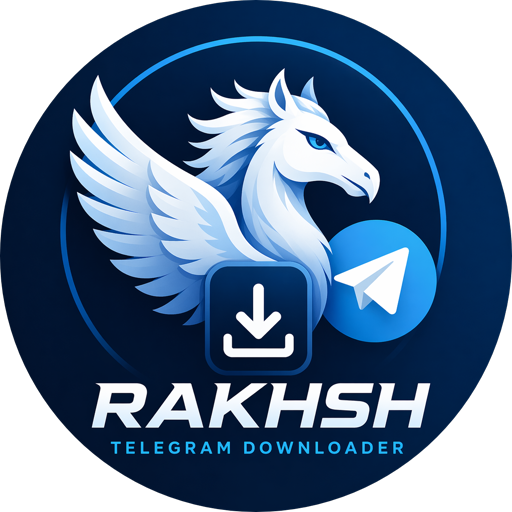

# Rakhsh

<p align="center">
  
</p>

Rakhsh is a Telegram bot that retrieves files from Telegram or external URLs, stores them locally, and exposes secret direct download links via HTTP.

[See Persian version (auto translate)](./README_FA.md)

---

## Operating Modes

### bot_api (default)

* Uses Telegram Bot API with polling (`getUpdates`)
* Supports:
  * URLs
  * Documents, photos, videos, audio, voice, video notes
* Can optionally fallback to MTProto for large telegram files

### mtproto_user

* Uses a Telegram user account via MTProto (use `mtproto-session` subcommand to initialize)
* Requires:
  * `api_id`
  * `api_hash`
  * session file (store this file somewhere safe, default location is for simplicity)

---

## Large File Fallback (Bot API + MTProto)

When `telegram.mtproto.fallback_enabled: true`:

1. Attempt download via Bot API
2. On failure, retry using MTProto
3. If `fallback_forward_chat_id` is set:
   * Bot forwards message to channel
   * MTProto downloads from forwarded message
4. If message originates from the MTProto user:
   * Direct fetch is attempted

Requirements:

* MTProto session must be authenticated
* MTProto account must have access to the source chat
* Or use `fallback_forward_chat_id` for relay

Recommended setup:

* Use a private channel as relay target
* Ensure MTProto account has access to that chat
* Retrieve `chat_id` using `/ids` command
* Use that value as `fallback_forward_chat_id`
* Both user and the bot must be in the channel, also but should be able to send message to the channel

---

## Features

* SOCKS5 proxy support for all outbound traffic
* Resumable downloads using HTTP Range (`.part` files)
* Support both small (>20Mb) and large (<20Mb) telegram files
* Built-in HTTP file server
* Link secured via MD5 hash in filename and query
* Live progress updates via message editing
* Context-aware shutdown
* Structured logging

---

## MTProto Setup

Using `mtproto-session` these configurations are handled automatically, more information are provided in the execution section.

Manual:

> Required fields:
>
> * `telegram.mtproto.api_id`
> * `telegram.mtproto.api_hash`
> * `telegram.mtproto.session_file`

### Obtaining API Credentials

1. Visit: [https://my.telegram.org/apps](https://my.telegram.org/apps)
2. Create an application
3. Copy `api_id` and `api_hash`

---

### Setting Relay Chat ID

1. Create a private channel or chat
2. Send `/ids` to the bot
3. Extract `chat_id` from response
4. Assign it to `fallback_forward_chat_id`

---

## Execution

Run application:

```bash
go run . -c config.yaml
```

Initialize MTProto session:

```bash
go run . mtproto-session
```

Or with explicit parameters:

```bash
go run . mtproto-session \
  --session ./secrets/mtproto.session \
  --api-id 12345 \
  --api-hash "0123456789abcdef0123456789abcdef"
```

This process:

* Prompts for missing credentials
* Performs login
* Stores session
* Outputs authentication status

---

## Output Format

Generated links follow: `https://example.com/files/file_<md5>.zip?h=<md5>`

---

## Notes
* Proxy settings apply globally to:
  * Telegram API
  * MTProto
  * HTTP downloads
* Incorrect proxy configuration results in total network failure
* Prefer relay-based fallback over direct MTProto self-fetch due to stability issues
